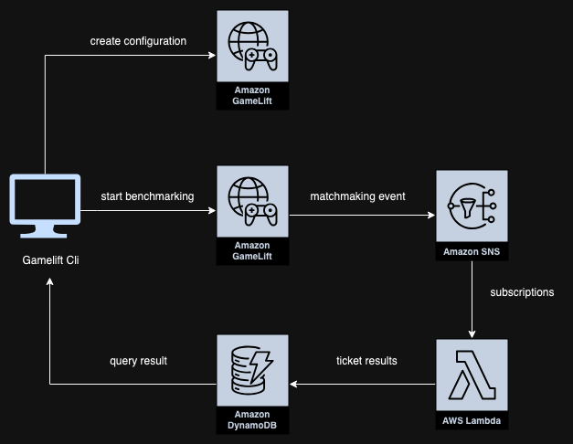
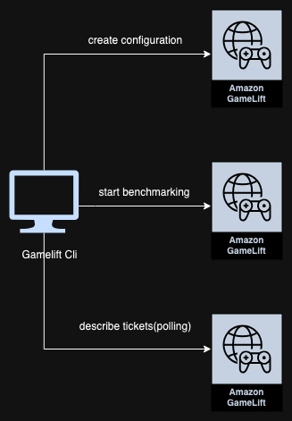
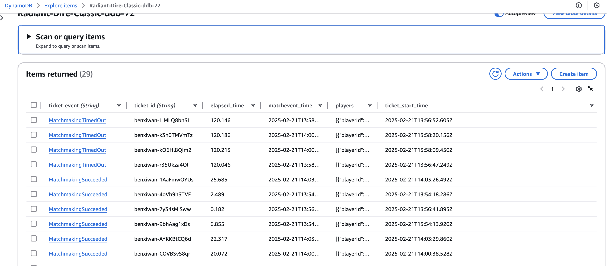

# Sample Simulator for AWS Gamelift Flexmatch Matchmaking

## Project Introduction

This project is a sample simulator for AWS GameLift FlexMatch service. It allows game developers to simulate large-scale matchmaking scenarios, test different matchmaking configurations, and compare the performance differences between multi-pool matchmaking and single matchmaking pool.

Key features:
- Support for JSON configuration
- Dynamic updating of rule sets and their association with FlexMatch configurations
- Support for all-in-one and separate rule sets
- Benchmark testing using a multi-threaded model
- Support for multiple game modes (Classic, Practice, Survival)
- Support 2 types notification lambda + polling

** notify-lambda **



** notify-polling **



## Prerequisites

- AWS account with GameLift service set up
- Python 3.7+
- AWS CLI configured with appropriate permissions
- Matchmaking configurations created in the AWS GameLift console

## Installation

1. Clone the repository:
   ```
   git clone https://github.com/aws-samples/sample-simulator-gamelift-flexmatch-matchmaking.git
   cd sample-simulator-gamelift-flexmatch-matchmaking
   ```

2. Install dependencies:
   ```
   pip install -r Multi-pools/requirements.txt
   ```

## Configuration

### Configuration File

Open and edit the `Multi-pools/Configs/config.json` file. The file structure is as follows:

```json
{
  "version": "1.0",
  "aws":{
    "region": "us-east-1"
  },
  "notify":"lambda", // lambda | polling
  "flexmatch":{
    "configurations": [{
      "name": "Radiant-Dire-Survival",
      "active": false,
      "acceptance": 0,
      "ruleset":"RadiantDire-Survival"
    },{
      "name": "Radiant-Dire-Practice",
      "active": false,
      "acceptance": 0,
      "ruleset":"RadiantDire-Practice"
    },{
      "name": "Radiant-Dire-Classic",
      "active": true,
      "acceptance": 0,
      "ruleset":"RadiantDire-Classic"
    },{
      "name": "Radiant-Dire-All",
      "active": false,
      "acceptance": 0,
      "ruleset":"RadiantDire-All"
    }]
  },
  "sample":{
    "gameModes": [ "Classic", "Practice", "Survival" ],
    "playerData":{
      "latency": {
        "median": 70,
        "std_dev": 20
      },
      "skill": {
        "median": 2000,
        "std_dev": 400
      },
      "GameMode":{
        
      }
    }
  },
  "benchmark":{
    "ticketPrefix": "benxiwan-",
    "logs": "output.txt",
    "totalPlayers": 10,
    "acceptance": {
      "rate": 1,
      "timeout": 10
    },
    "teamSize": {
      "default": 5,
      "small": 2
    }
  }
}
```

Configuration file explanation:
- `aws`: Set AWS region
- `flexmatch`: Define FlexMatch configurations
  - `name`: Matchmaking configuration name (must match the configuration name in the AWS console)
  - `active`: true or false
  - `acceptance`: Accept timeout in seconds
  - `ruleset`: Corresponding rule set name
- `sample`:
  - `playerData`: Simulated player data settings
  - `gameModes`: Game modes to test
- `benchmark`: Set benchmark test parameters
  - `ticketPrefix`: Matchmaking ticket prefix
  - `logs`: Log file name
  - `totalPlayers`: Total number of players
  - `acceptance`: Matchmaking acceptance settings
  - `teamSize`: Team size settings
 

Note: The benchmark section is used to set log file location, total number of players, game modes, and other parameters. Currently, this tool runs in standalone mode. If you need to run in fleet mode, you'll need to manually set related parameters. Fleet mode may require additional configuration, such as specifying the GameLift fleet ID.

Make sure to modify the configuration to suit your needs and AWS environment. If you need to run tests in fleet mode, please refer to the AWS GameLift documentation to learn how to configure and manage fleets.

## Usage

Run `main.py` in the `Multi-pools` directory with the following command-line options:

```
python main.py [options]

Options:
  -help: Show this help message
  -print: output json of all configurations
  -flexmatch: Create configuration if not exist and Update configuration rulesets
  -sample: sample json of a player
  -destroy: destroy resources
  -benchmark: Start a benchmark
  -result: Get the last benchmark result
```

Examples:
1. View help information:
  ```
  python main.py -help
  ```

2. Update FlexMatch settings:
  ```
  // use config file setting
  python Multi-pools/main.py -flexmatch
  // set notiy type
  python Multi-pools/main.py -flexmatch=polling|lambda
  ```

3. Run benchmark test:
  ```
  // use config file setting
  python Multi-pools/main.py -benchmark
  // set custom players size 
  python Multi-pools/main.py -benchmark=200
  ```
4. Get Last benchmark result:
  ```
  python Multi-pools/main.py -result
  // set the benchmark id you want to retrieve
  python Multi-pools/main.py -result=27
  ```

5. Run sample player:
  ```
  python Multi-pools/main.py -sample
  ```

6. Recycling/Destroy the resources:
  ```
  python Multi-pools/main.py -destroy
  ```

7. Chain the commands together
  ```
  // 1. destroy previous resource
  // 2. build lambda based notification pipeline
  // 3. bechmark with 200 players
  // 4. get the result
  python Multi-pools/main.py -destroy -flexmatch=lambda -benchmark=200 -result
  ```
   
## Interpreting Benchmark Results (polling)

in Configs
```
"notify":"polling",
```

The benchmark results will display the following information for each matchmaking configuration:
- Number of completed tickets and average matchmaking time
- Number of failed tickets and average time

Generally, multi-pool rule sets may have an advantage in time efficiency compared to all-in-one rule sets.

Example output:

```
## benchmark all-in-one:
Matchmaking Monitor for [Radiant-Dire-All] Done!
Complete Tickets: 175, Average Time: 36.08 seconds
Failed Tickets: 508, Average Time: 41.61 seconds

## benchmark multi-pools:
Matchmaking Monitor for [Radiant-Dire-Practice] Done!
Complete Tickets: 319, Average Time: 30.68 seconds
Failed Tickets: 342, Average Time: 34.14 seconds

Matchmaking Monitor for [Radiant-Dire-Classic] Done!
Complete Tickets: 311, Average Time: 34.03 seconds
Failed Tickets: 376, Average Time: 35.61 seconds

Matchmaking Monitor for [Radiant-Dire-Survival] Done!
Complete Tickets: 1028, Average Time: 24.03 seconds
Failed Tickets: 309, Average Time: 29.45 seconds
```

## Interpreting Benchmark Results (lambda)

in Configs
```
"notify":"lambda",
```
In this approach, you will create a FlexMatch configuration with the configuration name, and then a series of services will be generated: SNS, Lambda, and DynamoDB.

For example, if our configuration name is "Radiant-Dire-Classic", then the SNS name will be "Radiant-Dire-Classic-sns", the generated Lambda service will be "Radiant-Dire-Classic-lambda", and finally, a DynamoDB table will be created with the name "Radiant-Dire-Classic-ddb".

example result of benchmark



and then use 'result' command to get the data!!

## Troubleshooting

1. Ensure that AWS CLI is correctly configured and has sufficient permissions.
2. Verify that the matchmaking configuration names in `config.json` exactly match those in the AWS GameLift console.
3. If you encounter a "configuration does not exist" error, check if you have created the corresponding matchmaking configuration in AWS GameLift.
4. If you need to run tests in fleet mode but encounter issues, make sure you have correctly configured the GameLift fleet and specified the correct fleet ID in the configuration.

## Frequently Asked Questions

Q: Why are my benchmark results different from the example?
A: Results may vary due to multiple factors, including AWS region, current load, configuration parameters, etc. Please interpret the results based on your specific needs and environment.

Q: How do I add a new game mode?
A: Add a new configuration in the `flexmatch.configurations` section of `config.json`, and make sure to create a corresponding matchmaking configuration in the AWS GameLift console.

Q: How do I switch to fleet mode?
A: Currently, the tool runs in standalone mode by default. To switch to fleet mode, you need to modify the code to support fleet-specific parameters and add relevant settings (such as fleet ID) to the configuration file. Please refer to the AWS GameLift documentation for more information on fleet management.

